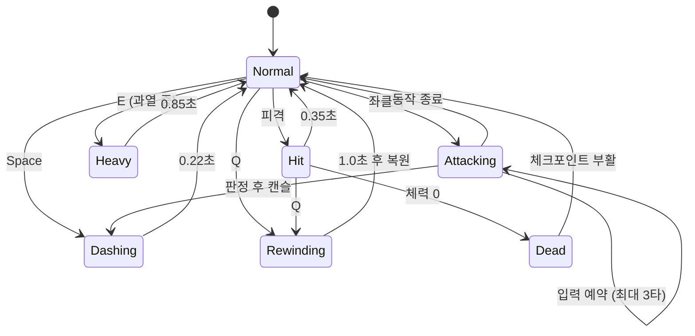
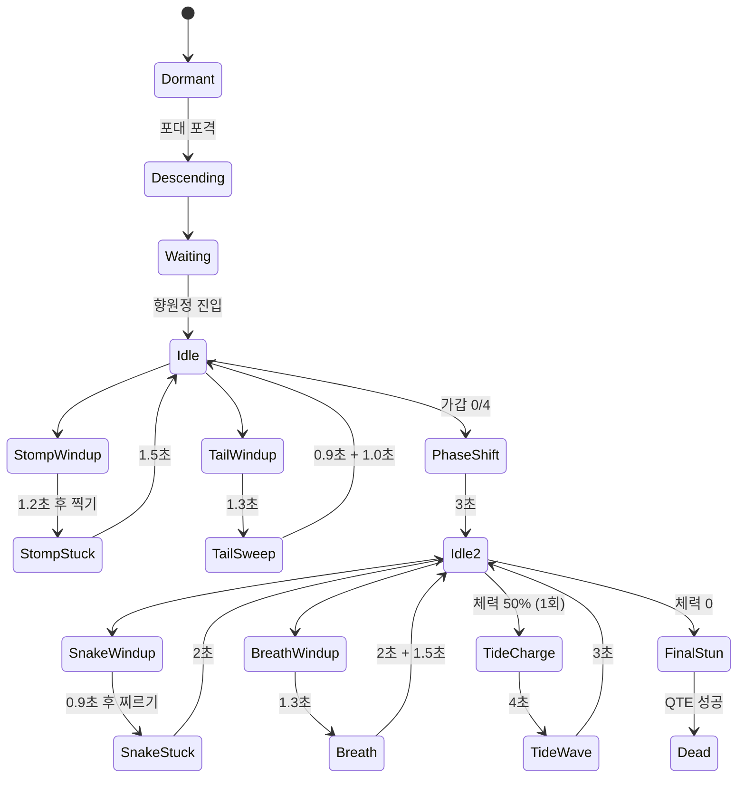
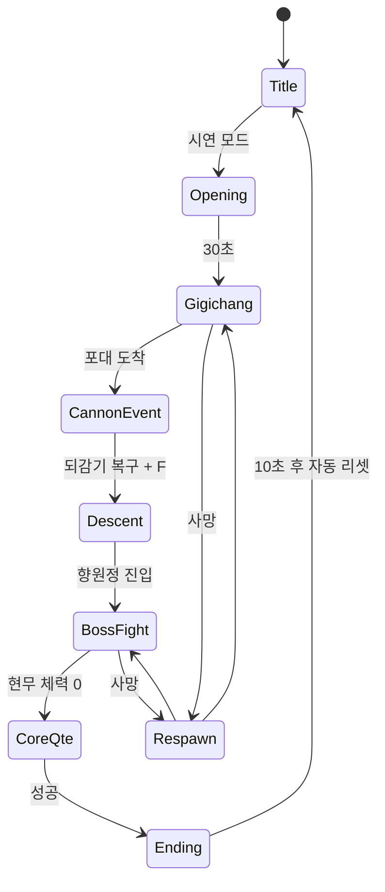

# 《현무: 역류의 어명 (玄武: The Reversed Decree)》 최종 통합 게임 제작 기획서

> 기준: `현무_고종시대_시간역행_프롬프트_v2`
> 개정: 2026-10-01 · **패링 시스템 삭제, 마감 2026-11-03(화) 기준으로 범위·일정 재조정**
> 연계: `현무_퀘스트_인벤토리_기획` · 유니티 월드 씬 `Assets/Scenes/NMJ/HyeonmuWorld_Main.unity`
> 작성: NMJ(나민재)

---

## 0. 개요

### 0-1. 마감 목표

> **11월 3일(화)까지 "10분 시연 빌드(현무 토벌전)"를 처음부터 끝까지 막힘 없이 플레이할 수 있게 만든다.**
> 60분 풀 버전은 이 시연 빌드를 뼈대로 다음 단계에서 확장한다.

| 항목 | 내용 |
|---|---|
| 장르 | 동양 다크 판타지 스팀펑크 액션 (근접 액션 + 보스전) |
| 시점 | 3인칭 백뷰 |
| 아트 | 수묵 동양화풍 + 오방색 포인트 |
| 마감 | 2026-11-03(화) · 작업일 22일 (10/1부터, 휴일 제외) |
| 산출물 | 10분 시연 빌드 1개 (Windows) |
| 엔진 | Unity 6000.6 · URP · Input System |
| 핵심 재미 | ① 때려서 과열을 쌓고 **고압 참격**으로 현무의 껍질을 깨는 리듬 ② 실수했을 때 **5초 되감기**로 되돌리는 시간 조작 |

### 0-2. 패링 삭제에 따른 변경 요약

| 이전 | 변경 |
|---|---|
| 우클릭 화승총 패링 | **삭제.** 방어 수단은 대시 회피 하나로 통일 |
| 패링으로 과열 충전 | 적과 **현무 가갑을 때려서** 충전 (타격당 +8) |
| 패링 → 적 휘청 | 큰 공격 뒤에 **빈틈(후딜) 구간**을 두고, 피한 뒤 그 구간에 반격 |
| 백동수 자세 붕괴(패링 3회) | 고압 참격에 맞으면 그로기 |
| 현무 찍기 패링 | 찍은 다리가 1.5초 박혀 있는 동안 측면 공격 |
| 뱀 찌르기 패링 | 찌른 뒤 뱀 머리가 2초 땅에 박힘 → 머리 공격(피해 ×1.5) |
| 선견(되감기 후 패링 판정 2배) | **삭제.** 되감기 직후 0.5초 무적으로 대체 |
| 화승총 | 등에 멘 **장식(복장)**으로만 유지 |

### 0-3. 세계관 요약

- **때와 곳:** 고종 24년(1887) 정월, 건청궁에 조선 최초의 전등이 켜지던 밤.
- **사건:** 향원정 물로 돌리던 증기 발전기('물불')가 폭주해 신맥을 뚫었다. 그 아래 잠들어 있던 메카닉 신수 **현무**가 깨어났다.
- **재앙:** 현무는 열기와 **'흐르는 시간'**을 삼킨다. 도성은 그 순간에 멈춰 얼어붙었다.
  - 눈송이가 허공에 걸려 있다.
  - 병사와 백성은 변이병이 되었다.
  - 흑수회가 민심을 선동한다.
- **시동:** 고종이 친군영 비밀 무사에게 **과열 스팀 팩**과 **역류 혼천의(5초 되감기)**를 채우고 현무 토벌 어명을 내린다.

### 0-4. 오방색 의미 체계

| 색 | 의미 | 쓰이는 곳 |
|---|---|---|
| 흑 | 현무, 동결 | 현무 본체, 흑수 해일 |
| 적 | 열기, 저항 | 스팀 팩, 과열 모드, 고압 참격, **공격 예고 표식** |
| 청 | 시간 | 역류 혼천의, 되감기 연출, 냉기 브레스 예고 |
| 백 | 무너진 신념 | 백동수 |
| 황 | 어명, 생명의 핵 | 고종, 신핵, 해빙 엔딩 |

---

## 1. 개발 범위 (11/3 마감)

### 1-1. 우선순위

| 등급 | 뜻 | 항목 |
|---|---|---|
| **P0 (필수)** | 없으면 시연이 안 됨 | 플레이어 이동·대시·3연 베기, 과열 + 고압 참격, 5초 되감기, 변이병 1종, 기기창 구간 + 포대 되감기 기믹, 현무 1·2페이즈, 신핵 QTE, 해빙 엔딩, 타이틀(시연 버튼) + 자동 리셋, 기본 HUD |
| **P1 (여유 있으면)** | 있으면 완성도가 오름 | 사망 직후 되감기, 표적 고정, 현무 '시간 역류' 패턴, 인삼 증기환 퀵슬롯, 퀘스트 트래커, 오프닝 컷씬 연출 강화 |
| **P2 (다음 단계)** | 풀 버전 확장 | 백동수 보스전, 운종가·광화문 구간, 프롤로그, 행낭 UI, 흑수회 적, 민심 NPC 시스템, 60분 풀 진행 |

### 1-2. 일정 (11/3 마감 · 작업일 22일)

휴일: 10/3(토) 개천절, 10/5(월) 대체공휴일, 10/9(금) 한글날

| 주차 | 기간 | 작업일 | 개발 | 에셋 (VARCO) | 완료 기준 (빌드) |
|---|---|---|---|---|---|
| 1주 | 10/1(목) ~ 10/8(목) | 5일 | **조작 프로토타입:** 이동·카메라·대시·3연 베기·HUD 골격, 되감기 1차, `NMJ_GameBalance` | 주인공 3D 메시 → Rig → 기본 동작 | **10/8(목)** 치고 피하고 되감기가 된다 |
| 2주 | 10/12 ~ 10/16 | 5일 | **알파:** 과열·고압 참격, 변이병(NGH AI 연동), 기기창 구간, 포대 기믹, 오프닝 Timeline 초안 | 변이병, 환도, 증기 포대(부서진 버전 포함) | **10/16** 시연 00:00~04:00이 이어서 플레이된다 |
| 3주 | 10/19 ~ 10/23 | 5일 | **베타:** 현무 1·2페이즈, 흑수 해일, 신핵 QTE, 엔딩 초안 | 현무 부위별 메시(몸통·가갑·다리·머리·뱀 목) | **10/23** 10분이 처음부터 끝까지 이어진다 → **기능 동결** |
| 4주 | 10/26 ~ 10/30 | 5일 | **완성도:** 블록아웃 → 3D 메시 교체, SFX, UI 아트, 타이틀·자동 리셋, 밸런스, (여유 시 P1) | 메시 교체, VFX 다듬기 | **10/30** 팀 밖 사람이 설명 없이 완주한다 |
| 마감 | 11/2(월) ~ 11/3(화) | 2일 | 버그 수정만, 시연 리허설, 최종 빌드 | — | **11/2 저녁 빌드 잠금 · 11/3 제출** |

- **1주차가 가장 짧다.** 휴일 때문에 작업일이 5일뿐이라, 조작감과 되감기에만 집중한다. 빌드는 금요일(한글날) 대신 목요일에 뽑는다.
- **기능 동결(10/23):** 이후에는 새 기능을 넣지 않는다. 에셋 교체, 수치 조정, 버그 수정만 한다.
- **P1 착수 조건:** 3주차 베타가 10/23에 통과했을 때만 4주차 앞쪽(10/26~10/28)에 P1을 넣는다. 우선순위는 사망 직후 되감기 → 인삼 증기환 → 표적 고정 순서다.
- **마감 이틀은 비워 둔다.** 버그 수정과 리허설용 여유분이라 새 작업을 잡지 않는다.

### 1-3. 마감 안에 끝내기 위한 원칙

1. **이미 있는 것을 쓴다.**
   - 적 AI: 팀의 `NGH_EnemyAI`(배회·인지·추적·근접 공격)
   - 히트박스: `NGH_EnemyAttackHitbox`
   - 오브젝트 풀: `NGH_ObjectPool`
   - 퀘스트·인벤토리: NMJ의 `QuestManager` / `PlayerInventory`
   - 맵: 월드 씬 블록아웃
2. **방어는 대시 하나.** 판정 종류를 줄여 버그와 밸런스 작업을 줄인다.
3. **애니메이션은 최소 세트.**

   | 대상 | 동작 |
   |---|---|
   | 주인공 | 대기, 달리기, 대시, 베기 3종, 고압 참격, 피격, 사망 |
   | 변이병 | 대기, 걷기, 공격, 피격, 사망 |
   | 현무 | 코드로 움직이는 부위 애니메이션(다리·목·머리 회전)으로 처리 |

   VARCO Rig/Animate로 휴머노이드 기본 동작을 받아 쓴다.
4. **수치는 데이터로 뺀다.** 밸런스 값은 ScriptableObject 하나(`NMJ_GameBalance`)에 모아 코드 수정 없이 조정한다.

---

## 2. [시스템 기획]

### 2-1. 조작

| 입력 | 행동 | 등급 |
|---|---|---|
| WASD / 마우스 | 이동 / 시점 | P0 |
| 좌클릭 | 3연 베기 | P0 |
| Space | 대시 회피 (무적) | P0 |
| E | 고압 참격 (과열 중) | P0 |
| Q | 5초 되감기 | P0 |
| F | 상호작용 (포대 가동, 신핵 QTE 시작) | P0 |
| 1 | 인삼 증기환 | P1 |
| T | 표적 고정 | P1 |

### 2-2. 기본 능력치

| 항목 | 값 |
|---|---|
| 최대 체력 | 100 |
| 이동 속도 | 6.0 m/s |
| 대시 | 0.22초 동안 16 m/s · **무적 0.30초** · 재사용 0.5초 |
| 피격 | 경직 0.35초 + 넉백, 이후 0.6초 무적(연속 피격 방지) |

### 2-3. 3연 베기

| 타 | 피해 | 총 동작 | 판정 시점 | 사거리 / 각 |
|---|---|---|---|---|
| 1타 | 12 | 0.40초 | 0.13초 | 2.4 m / 120° |
| 2타 | 14 | 0.40초 | 0.13초 | 2.4 m / 120° |
| 3타 | 22 | 0.60초 | 0.22초 | 2.4 m / 150° |

- 공격 중 입력하면 다음 타로 이어진다(입력 예약).
- 판정 이후에는 대시로 캔슬할 수 있다.
- 공격 시작 시 반경 5m 안의 가장 가까운 적 쪽으로 몸을 돌린다.
- **판정 방식:** 칼에 붙은 트리거 히트박스(태그 `PlayerAttack`)를 판정 시점에만 0.1초 켠다. 한 번 휘두를 때 같은 대상은 한 번만 맞는다.

### 2-4. 증기 과열 & 고압 참격

| 항목 | 값 |
|---|---|
| 게이지 | 0~100 |
| 충전 | 적 또는 현무 가갑 타격 1회당 +8 (가갑은 피해 없이 게이지만 오른다) |
| 과열 모드 | 100이 되면 10초 동안 발동 |
| 과열 중 | 공격력 ×1.5, 이동 ×1.1, 초당 최대 체력 1.5% 소모 (체력 1 미만으로는 떨어지지 않음) |
| 식음 | 4초 동안 타격이 없으면 초당 5씩 감소 |
| 고압 참격 (E) | 과열 중에만 사용. 준비 0.3초 → 사거리 4.4m, 220° 부채꼴, 피해 90 → 총 0.85초. 사용하면 과열이 끝나고 게이지 0 |

- **핵심 루프:** 가갑·적을 때려 게이지를 채운다 → 과열 → 고압 참격으로 가갑을 깬다. 현무의 흑철 가갑을 깨는 수단은 고압 참격 하나뿐이다.

### 2-5. 역시(逆時) 5초 되감기

| 항목 | 값 |
|---|---|
| 기록 | 0.02초마다 1장, 5초 분량(250장) 링 버퍼 |
| 역시 톱니 | 최대 2칸, 1칸당 15초마다 재충전 |
| 연출 | 실시간 1.0초 동안 기록을 거꾸로 따라감 + 청색 화면 연출, 세계 속도 ×0.3 |
| 되감기 후 | 0.5초 무적 |

**되돌아가는 것과 아닌 것**

| 되돌아감 | 되돌아가지 않음 |
|---|---|
| 플레이어 위치·회전·체력 | 적, 보스 |
| 과열 게이지·과열 남은 시간 | 과열로 깎인 체력 |
| — | 인벤토리, 퀘스트 진행 |

```
복원 체력 = 5초 전 체력 − (현재 과열 누적 소모 − 5초 전 과열 누적 소모)   (최소 1)
```

- **환경 되감기:** 범용 시스템으로 만들지 않는다. 이번 마감에는 **기기창 포대 하나만** 스크립트로 처리한다. 포대가 부서진 상태에서 반경 14m 안에서 되감으면 원상 복구.
- **사망:** 체크포인트(기기창 입구, 향원정 입구)에서 다시 시작한다. 체력·톱니는 가득, 과열은 0, 보스는 처음 상태가 된다. *(P1: 사망 직후 3초 안에 Q를 누르면 되감기로 살아남)*

### 2-6. 피해 공식

```
플레이어 → 적 = 기본 피해 × 과열 배율(1.0 / 1.5) × 빈틈 배율
  빈틈 배율: 평소 1.0 / 현무 다리 박힘·뱀 머리 박힘 1.5

적 → 플레이어 = 공격 피해
  대시 무적·피격 후 무적·되감기 후 무적 중이면 0
  흑수 해일은 체력 1 미만으로 떨어지지 않음
```

### 2-7. 체크포인트 · 소모품

| 항목 | 내용 | 등급 |
|---|---|---|
| 체크포인트 | 기기창 입구, 향원정 입구 2곳 | P0 |
| 인삼 증기환 | 시작 시 3개 지급, 체력 40% 회복, 사용 동작 0.8초 | P1 |

---

## 3. [전투 & 보스 기획]

모든 적의 공격은 **"예고 → 판정 → 빈틈"** 세 박자로 만든다. 예고를 보고 대시로 피한 뒤 빈틈에 반격하는 것이 기본 공략이다.

### 3-1. 변이병 (P0) — `NGH_EnemyAI` 기반

| 항목 | 값 |
|---|---|
| 체력 | 60 |
| 이동 / 인지 | 3.0 m/s / 12 m |
| 공격 | 사거리 2.0m. **무기가 붉게 빛나는 예고 0.8초** → 내려치기, 피해 12 |
| 빈틈 | 공격 후 1.0초 (반격 구간) |
| 재공격 | 1.2~2.0초 |
| 처치 | 퀘스트 처치 보고 |

- **공략:** 붉게 빛나면 옆으로 대시한다 → 빈틈 1초 동안 3연 베기.
- **NGH 쪽 요청 사항** (`NGH_EnemyAI_Requests.md` 방식으로 전달):
  - 공격 예고 시간과 무기 발광 훅
  - 공격 후 빈틈 시간 파라미터
  - 사망 이벤트

### 3-2. 최종 보스 — 현무 (P0)

**공통 사항**

- 전장은 얼어붙은 향원정 연못(반경 30m)이다. 보스는 중앙에 서서 플레이어 쪽으로 천천히 돈다(초당 30°).
- 몸통에 큰 콜라이더를 두어 플레이어가 안으로 들어가지 못하게 한다.

#### 1페이즈 [흑철의 가갑] — 목표: 가갑 4장 파괴

- 체력바는 가갑 장수(4/4)로 표시한다.
- 가갑은 몸 양옆과 뒤쪽에 있어, 옆으로 돌아가야 닿는다.

| 패턴 | 예고 | 판정 · 피해 | 빈틈 (반격 기회) |
|---|---|---|---|
| 흑철 찍기 | 플레이어 발밑에 **적색 원판(반경 3.5m)**이 1.2초 동안 진해짐 | 원판 안이면 25 | 찍은 다리가 1.5초 박힘 → 그쪽 측면 가갑을 때리기 좋음 |
| 꼬리 휩쓸기 | 몸 둘레 **적색 고리(4.5~15m)** 1.3초 | 0.9초에 걸쳐 360° 휩쓸기, 22 | 휩쓸기 후 1.0초 정지 |
| *(P1) 시간 역류* | 청색 고리 + 초침 소리, 4초 시전 | 다 차면 부서진 가갑 1장 복원 | 머리를 4번 치거나 고압 참격으로 끊기 |

- **공략 리듬:** 찍기를 피한다 → 박힌 다리 쪽 가갑을 때려 과열 → 고압 참격으로 가갑 파괴. 4장을 깨면 2페이즈로 넘어간다.
- **패턴 순서:** 찍기 2회 → 꼬리 1회를 기본으로 반복하고, 플레이어가 15m 밖에 있으면 찍기만 쓴다.

#### 페이즈 전환 (3초 연출)

포효와 함께 톱니가 빠르게 돌고 뱀의 목이 솟는다. 체력바가 2페이즈 체력 **700**으로 바뀐다.

#### 2페이즈 [쌍두의 폭주] — 목표: 체력 700 → 0

| 패턴 | 예고 | 판정 · 피해 | 빈틈 |
|---|---|---|---|
| 뱀의 목 찌르기 | **미래 잔상:** 반투명 백색 뱀 머리가 먼저 목표 지점에 내려앉고 바닥에 적색 원(2.5m)이 0.9초 표시 | 원 안이면 24 | 뱀 머리가 **2초 땅에 박힘** → 머리 공격 피해 ×1.5 |
| 냉기 브레스 | 거북 머리 앞 **청색 부채꼴(55°, 16m)** 1.3초 | 2초 지속, 0.25초마다 5 | 브레스 후 1.5초 정지 |
| 흑철 찍기 / 꼬리 휩쓸기 | 1페이즈와 같음 | 같음 | 같음 |
| **흑수 해일** | 체력 50%에서 1회. 4초 동안 검은 기운이 부풀고 "피할 수 없다 — 맞은 뒤 Q로 되감아라" 안내 | 1.0초 만에 36m까지 퍼지는 고리, 최대 체력의 70% (체력 1 미만 불가) | 해일 후 3초 대기 |

- **흑수 해일의 역할:** 되감기를 보스전 한가운데서 반드시 한 번 써 보게 만드는 장치다. 무적 대시 타이밍으로도 피할 수 있다.
- **피격 부위:** 몸통(×1.0), 거북 머리(×1.0), 박힌 뱀 머리(×1.5). 2페이즈에서는 일반 공격과 고압 참격 모두 체력을 깎는다.

#### 마무리 — 신핵 처형 QTE

1. 체력이 0이 되면 현무가 주저앉고 가슴의 **신핵(황)**이 드러난다.
2. 신핵 앞에서 **F** → **[E] → [좌클릭] → [Q]** 3단 입력을 한다. 단계마다 2.0초가 주어지고, 실패하면 1단계부터 다시 한다.
3. 성공하면 엔딩.

### 3-3. 중간 보스 — 백검 백동수 (P2, 다음 단계) ※ 가상의 인물

| 패턴 | 예고 | 피해 | 공략 |
|---|---|---|---|
| 삼연 발도 | 칼이 백색으로 빛나며 0.5초 | 13 × 3 | 1·2타는 뒤로 대시, 3타 뒤 빈틈 1.2초 |
| 돌진 베기 | 0.9초 자세 잡기 | 20 | 옆으로 대시 → 지나간 뒤 등 공격 |
| 서리 검기 | 0.7초 | 16 | 대시로 통과 |
| 잔상 되감기 | 백색 잔상 | — | 체력 50% 이하에서 1회, 3초 전으로 복귀 |

- **그로기:** 고압 참격에 맞으면 3초 그로기(받는 피해 ×2).
- 체력 450. 패배하면 고압 참격 해금(본편 기준).

---

## 4. [레벨 & 연출 기획]

### 4-1. 10분 시연 타임라인 (11/3 결과물)

| 시간 | 장면 | 카메라 | 효과음(SFX) | UI |
|---|---|---|---|---|
| 00:00~00:30 | 오프닝: 전등 점화 → 폭주 → 눈송이가 허공에 멈춤 | 건청궁 전구 클로즈업 → 크레인 업으로 멈춘 도성 전경 (Timeline 1개) | 징, 발전기 굉음, 정적 속 초침 | 붓글씨 자막 3줄 |
| 00:30~02:00 | 기기창 입구, 변이병 2마리 | 3인칭 백뷰 (거리 5.4m, 오른쪽 어깨) | 칼바람, 타격음, 대시 증기음 | "붉게 빛나면 Space로 피하라" 첫 안내 1회 |
| 02:00~03:00 | 꼬리 내려찍기 구간 통과 → 포대 도착 → 꼬리가 포대를 박살 | 포대와 꼬리가 함께 보이는 고정 구도 2초 → 백뷰 | 충격음, 쇳조각 비 | "Q — 5초 되감기로 포대를 되살려라" 청색 안내 |
| 03:00~04:00 | 되감기로 포대 복구 → F 가동 → 연발 포격 → 현무가 향원정으로 추락 | 되감기: 청색 화면 / 포격: 탄도 추적 → 원경 (Timeline 1개) | 역재생 음, 연발 포성, 포효 | "玄武" 붓글씨 등장 |
| 04:00~06:30 | 현무 1페이즈 | 백뷰, 찍기 때 살짝 줌아웃 | 찍기 저음, 가갑 깨지는 소리 + 징 | 가갑 4/4 바, "가갑 파괴" 알림 |
| 06:30~07:00 | 페이즈 전환 | 뱀 목을 따라 틸트 업 | 포효, 톱니 가속 | "쌍두의 폭주" 대형 알림 |
| 07:00~09:00 | 현무 2페이즈 (흑수 해일 1회) | 해일 충전 때 줌아웃 | 초침 가속, 해일 굉음 | "지금이다 — Q" 안내 |
| 09:00~09:40 | 신핵 처형 QTE | 신핵 정면 클로즈업 | 단계마다 징·쇳소리·태엽 역회전 | 중앙 대형 키 아이콘 + 원형 타이머 |
| 09:40~10:00 | 해빙: 눈이 다시 떨어지고 해가 뜸 → 로고 → 자동 리셋 | 도성 전경 와이드 | 얼음 깨지는 소리 → 징 | 로고 후 10초 지나면 타이틀로 |

- **시연 진행 보조:**
  - 보스전에서 3번 죽으면 현무 체력을 20% 깎고 시작한다(관람객 완주용).
  - 아무 입력 없이 60초가 지나면 타이틀로 돌아간다.

### 4-2. 엔딩 연출 순서

1. QTE 성공 → 백색 섬광, 슬로우 모션.
2. 6초에 걸쳐 환경을 바꾼다.

   | 항목 | 변화 |
   |---|---|
   | 안개색 | 회청색 → 새벽 한지색 |
   | 눈 파티클 | 다시 떨어지기 시작 |
   | 태양 | 낮은 각도의 따뜻한 빛으로 회전 |

3. 현무가 연못 속으로 가라앉는다.
4. "玄武 · 역류의 어명" 로고.

> 월드 씬에 이미 있는 안개·눈·조명 설정값을 그대로 보간하면 되므로 추가 에셋이 필요 없다.

### 4-3. 카메라 · 타격감

| 항목 | 값 |
|---|---|
| 기본 | 거리 5.4m, 높이 1.7m, 어깨 0.55m, 상하 −25°~60°, 벽 충돌 시 당김 |
| 흔들림 | 타격 0.08 · 고압 참격 0.35 · 현무 찍기 0.8 · 현무 착지 1.2 |
| 히트스톱 | 타격 0.045초 · 고압 참격 0.12초 |
| 컷씬 | Unity Timeline 3개 (오프닝, 포격·추락, 엔딩) |

### 4-4. UI (P0 최소 세트)

- **HUD:**
  - 좌상단: 체력(먹붉은색), 과열(적), 역시 톱니 2칸(청)
  - 하단 중앙: 보스 바
  - 중앙: 알림 / 안내 문구
- **화면 효과:**
  - 되감기: 화면 청색 + 중앙 "逆時"
  - 과열: 가장자리 적색 비네트
- **타이틀:** [시연 모드: 현무 토벌전] 버튼 하나 + 조작 안내.
- **스타일:** 한지 질감 패널, 붓 획 게이지, 제목은 궁서 계열.

### 4-5. 레벨 (월드 씬 재사용)

`HyeonmuWorld_Main.unity`의 블록아웃 중 시연에 쓰는 곳만 게임플레이용으로 다듬는다.

- **기기창 구간 (약 40m):** 입구 체크포인트 → 변이병 2 → 꼬리 내려찍기 지점 2곳 → 포대
- **향원정 전장:** 반경 30m 원형, 바깥은 투명 벽, 입구 체크포인트

나머지 지역(운종가, 광화문, 근정전)은 배경으로만 둔다.

---

## 5. [아트 & 디자인 가이드]

### 5-1. 공통

- **기법:** 수묵 번짐, 먹선 외곽선, 두 톤 음영, 한지 결. 월드 씬의 `InkToon` / `InkOutline` 셰이더를 공용으로 쓴다.
- **채도:** 낮게 누르고 오방색은 의미 있는 곳에만 쓴다.
- **3D 제작:** VARCO 워크플로우로 처리한다.

  | 단계 | 방법 |
  |---|---|
  | 콘셉트 이미지 | 전신 · 단색 배경 · 정면 3/4 |
  | 메시 | Generate3D |
  | 휴머노이드 | Rig → Animate |

### 5-2. 11/3까지 필요한 에셋

| 에셋 | 방법 | 상태 |
|---|---|---|
| 주인공 (친군영 비밀 무사) | VARCO 콘셉트 → Generate3D(tPose) → Rig → Animate | 콘셉트 2장 완료 (`친군영무사_환도_패용`, `_파지`) |
| 스팀펑크 환도 | 기존 VARCO 이미지 → Generate3D | 이미지 있음 |
| 변이병 | 콘셉트 → 3D → Rig | 예정 |
| 현무 | 부위별 분리 제작(몸통·가갑 4장·다리 4·거북 머리·뱀 목 마디·뱀 머리·신핵) → 코드로 조립·애니메이션 | 블록아웃 있음 |
| 증기 포대 | 콘셉트 → 3D, 부서진 버전은 파츠 분리 | 블록아웃 있음 |
| 기기창 건물·소품 | 블록아웃 유지 → 시간 남으면 교체 | 블록아웃 있음 |
| VFX | 증기, 먹 튐, 불꽃, 청색 되감기 잔상, 예고 표식(적·청) | 셰이더 있음 |

### 5-3. 인물·보스 비주얼 요약

- **주인공**
  - 갓 + 놋쇠 고글 띠, 먹색 철릭, 적색 광다회 띠
  - 등에 적색 과열 스팀 팩과 청색 혼천의 고리, 화승총(장식)
  - 왼쪽 허리에 스팀펑크 환도
- **현무**
  - 흑철 거북 몸통에 육각 가갑, 부서지면 놋쇠 톱니와 증기가 드러남
  - 등에서 뱀의 목이 솟음, 눈은 청, 가슴 신핵은 황
  - 궁궐 담장 너머로 머리가 보일 만큼 거대함
- **변이병:** 회청색 철릭, 전립, 어깨와 등에서 얼음 결정이 자람, 푸른 눈빛.
- **고종:** 황색 곤룡포에 익선관. 오프닝 컷씬에만 등장한다. 실존 인물이므로 존중하는 묘사만 한다.

---

## 6. [개발 스크립트 가이드]

### 6-1. 규칙

- **위치:** NMJ 폴더에 둔다(`Scripts/NMJ`, `Prefabs/NMJ`, `Scenes/NMJ` …). 파일명은 `NMJ_` 접두사를 쓴다.
- **런타임 생성:** `NGH_ObjectPool.Spawn / Despawn`을 쓴다(잔상, 예고 표식, 파티클, 파편).
- **태그와 판정:** `Player`, `Boss`, `Enemy`, `PlayerAttack`, `EnemyAttack`. 판정은 트리거 히트박스 + 태그로 통일한다.
- **입력:** Input System(`InputSystem_Actions` 에셋에 액션 추가).
- **연동:** 퀘스트는 `QuestManager.ReportKill / ReportCustom`, 아이템은 `PlayerInventory`를 쓴다.
- **씬 구성:** 시연 씬은 `Scenes/NMJ/HyeonmuDemo.unity`로 새로 만든다. 월드 씬의 기기창·향원정 부분을 프리팹으로 떼어 배치한다.

### 6-2. 클래스 구조 (P0 기준 12개)

| 클래스 | 역할 | 주차 |
|---|---|---|
| `NMJ_GameBalance` (ScriptableObject) | 모든 수치 (이 문서의 표 값) | 1 |
| `NMJ_PlayerController` | 입력, 이동, 대시, 3연 베기, 피격·사망 | 1 |
| `NMJ_PlayerCamera` | 백뷰, 벽 충돌, 흔들림 | 1 |
| `NMJ_RewindSystem` | 링 버퍼 기록·재생, 톱니 | 1 |
| `NMJ_Hud` | 체력·과열·톱니·보스 바·알림 | 1~2 |
| `NMJ_OverheatGauge` | 과열 게이지, 과열 모드, 체력 소모 누적 | 2 |
| `NMJ_SteamCannon` | 포대: 부서짐 → 되감기 복구 → 가동 | 2 |
| `NMJ_TailSlamHazard` | 기기창 꼬리 내려찍기 함정 | 2 |
| `NMJ_HyeonmuBoss` | 현무 FSM, 부위 피격, 페이즈 | 3 |
| `NMJ_HyeonmuPlate` | 가갑 한 장 (피격 → 과열 충전, 고압 참격 → 파괴) | 3 |
| `NMJ_CoreQte` | 신핵 3단 입력 | 3 |
| `NMJ_DemoDirector` | 타이틀 → 오프닝 → 체크포인트 → 엔딩 → 자동 리셋 | 4 |

- 변이병은 새로 만들지 않고 `NGH_EnemyAI`에 맞는 파라미터와 훅을 요청해서 쓴다.

```csharp
// 적 → 플레이어 공격 정보 (EnemyAttack 히트박스가 들고 있다)
public struct NMJ_AttackInfo
{
    public float Damage;
    public float Knockback;
    public bool NonLethal;   // 흑수 해일
    public Vector3 Origin;
}
```

### 6-3. 상태 머신(FSM)

#### 플레이어



#### 현무



- 2페이즈의 찍기와 꼬리 휩쓸기는 1페이즈 상태를 그대로 재사용한다(그림에서는 생략).
- 패턴 선택은 가중치 랜덤 대신 **고정 순서 리스트**로 만든다. 예: 2페이즈 `[뱀, 찍기, 브레스, 뱀, 꼬리]` 반복. 밸런스 잡기와 시연 재현성이 쉬워진다.

#### 시연 흐름



### 6-4. 5초 되감기 링 버퍼

```csharp
public class NMJ_RewindSystem : MonoBehaviour
{
    const float Window = 5f;
    const float Interval = 0.02f;            // 50Hz → 250장

    struct Snapshot
    {
        public Vector3 Pos;
        public Quaternion Rot;
        public float Hp, Heat, HeatRemain, Drain;
        public bool Overheated;
    }

    readonly Snapshot[] buffer = new Snapshot[Mathf.CeilToInt(Window / Interval) + 1];
    int head, count;
    float timer;

    void Update()
    {
        if (IsRewinding || player.IsDead) return;
        timer += Time.deltaTime;
        while (timer >= Interval)
        {
            timer -= Interval;
            buffer[head] = Capture();
            head = (head + 1) % buffer.Length;
            count = Mathf.Min(count + 1, buffer.Length);
        }
    }

    Snapshot FromNewest(int i)                // 0 = 최근, count-1 = 5초 전
    {
        int idx = (head - 1 - i) % buffer.Length;
        return buffer[idx < 0 ? idx + buffer.Length : idx];
    }

    // 되감기: 톱니 -1 → 1초(실시간) 동안 FromNewest(0..count-1) 위치를 따라가며 잔상
    //  → 가장 오래된 기록 적용 (hp = s.Hp - (현재 누적 소모 - s.Drain))
    //  → 버퍼 비움 → 0.5초 무적 → 포대에 알림
}
```

- **주의:** `CharacterController`를 순간 이동시킬 때는 `enabled = false` → 위치 변경 → `enabled = true` 순서를 지킨다.

### 6-5. 리스크와 대응

| 리스크 | 대응 |
|---|---|
| 현무 3D 에셋이 늦게 나옴 | 3주차까지 블록아웃으로 패턴을 먼저 완성하고, 4주차에 메시만 교체. 교체가 안 되면 블록아웃 + 수묵 셰이더로 시연 |
| VARCO 리깅·애니메이션 품질 | 주인공 기본 동작만 VARCO로, 베기 동작은 칼 피벗 회전 코드로 보강 |
| 되감기와 보스 패턴이 꼬임 | 보스는 되감기지 않는다는 규칙을 고정. 되감기 중 플레이어 피격 무시 |
| 일정 지연 | P1부터 버림. 주차별 빌드(10/8·10/16·10/23·10/30)로 진척 확인, 10/23 기능 동결 |
| 시연 중 진행 막힘 | 3번 사망 보정, 60초 무입력 리셋, 투명 벽 점검 |
| 마감 직전 치명적 버그 | 11/2 저녁 빌드를 잠그고, 11/3에는 잠근 빌드로만 시연 |

---

## 부록 — 산출물 현황

| 산출물 | 위치 | 상태 |
|---|---|---|
| 세계관 프롬프트 v2 | `현무_고종시대_시간역행_프롬프트_v2.txt` | 완료 (패링 항목은 이 문서 기준으로 삭제) |
| 퀘스트·인벤토리 기획 | `현무_퀘스트_인벤토리_기획.txt` | 완료 (시연용 4단계로 축소 예정) |
| 세계관 월드 씬 | `Assets/Scenes/NMJ/HyeonmuWorld_Main.unity` | 블록아웃 완료 |
| 수묵 셰이더 | `Assets/Shaders/NMJ/HyeonmuWorld/` | 완료 |
| 주인공 콘셉트 | `친군영무사_환도_패용.png`, `친군영무사_환도_파지.png` | 완료 |
| 인벤토리·퀘스트 코드 | `Assets/Scripts/NMJ/` | 있음 (퀘스트 데이터 교체 필요) |
| 전투·되감기·보스 코드 | `Assets/Scripts/NMJ/` | 1주차부터 착수 |
